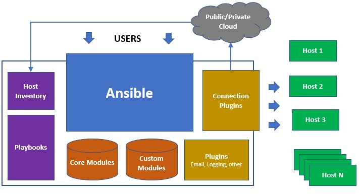

About me

---

# What usually I test
 

## System Tests
To guarantee that the total build fulfills the business specifications.

 
### Acceptance testing:  
to verify if requirement meets (SLO, Security, NFR)

 
### Integration Tests
To guarantee that joined units inside system can act together without problems.

---

### Interoperability Testing
To make sure whether the system can operate well with third-party products or not

 

### Regression Testing
To make sure the system’s stability as it passes through an integration or maintenance


### Compatibility testing  
to ensure that the system is (still) compatible

---


## Ad-Hoc
you can try it right now

 
```sh

ansible all -m ping -i inventory.ini
ansible server01 -i inventory.ini -a "date"

```

---

## How Ansible works



---

## Wide choice of connection

```

ansible-doc -t connection -l
ansible.netcommon.grpc         Provides a persistent connection using the gRPC protocol
ansible.netcommon.httpapi      Use httpapi to run command on network appliances
ansible.netcommon.netconf      Provides a persistent connection using the netconf protocol
ansible.netcommon.network_cli  Use network_cli to run command on network appliances
ansible.netcommon.persistent   Use a persistent unix socket for connection
community.aws.aws_ssm          execute via AWS Systems Manager
community.docker.docker        Run tasks in docker containers
community.docker.docker_api    Run tasks in docker containers
community.general.saltstack    Allow ansible to piggyback on salt minions
community.general.zone         Run tasks in a zone instance
community.libvirt.libvirt_qemu Run tasks on libvirt/qemu virtual machines
community.okd.oc               Execute tasks in pods running on OpenShift
community.vmware.vmware_tools  Execute tasks inside a VM via VMware Tools
containers.podman.podman       Interact with an existing podman container
kubernetes.core.kubectl        Execute tasks in pods running on Kubernetes
psrp                           Run tasks over Microsoft PowerShell Remoting Protocol
ssh                            connect via SSH client binary
winrm                          Run tasks over Microsoft's WinRM

```

---

## Playbooks: organize an actions as a runbook

```yaml

- name: Check if Rhein today is not deep enough
  hosts: localhost
  tasks:
    - name: Receive information
      ansible.builtin.set_fact:
        rhein_level: {{ lookup('url', 'https://api/level' }}
    - name: Check level
      assert:
        that:
          - rhein_level <= 60
        fail_msg: "Water level is too low"   

- name: Collect info
  hosts: web
  tasks:
   - name: Collect facts about distro
     setup: 
       filter:
         - 'ansible_distribution'
```

---


## Callbacks: change output

or produce machine readable output

```shell

ANSIBLE_NOCOLOR
ANSIBLE_CALLBACK_WHITELIST=json
ANSIBLE_STDOUT_CALLBACK=json,selective

```
example of community.general.selective
```yaml
- ansible.builtin.debug:
    msg: "This will not be printed"

- ansible.builtin.debug:
    msg: "But this will"
  tags: [print_action]

```

---


## Run your tasks in context

```yaml
## Here you setup scope
- hosts: webservers

## Here you can setup context
## Run VM, set downtimes

  pre_tasks:

    - name: take out of load balancer pool
      command: /usr/bin/take_out_of_pool {{ inventory_hostname }}
      ## Here you can delegate jobs somewhere
      delegate_to: 127.0.0.1

    - name: Create a downtime
      register: downtime_var
      community.general.datadog_downtime:
        state: present
        monitor_tags:
            - "balancer:tier3"
        downtime_message: "Downtime for balancer:tier3"
        scope: "test"
        ## will throw if downtime not created
        id: "{{ lookup('file', inventory_hostname ~ '_downtime_id.txt', errors='ignore') }}" 

```


---
 

```yaml

  ## Here goes main block
  tasks:
    ## You can execute tasks by blocks
    - name: Unsolicited upgrade
      block:
    ## Scripts are in /files directory, if exit non zero task failed
        - script: script --server {{ inventory_hostname }}
          delegate_to: testing_server
      rescue:
    ## Block run ALWAYS if something went wrong
        - name: Send notify to Telegram
          community.general.telegram:
            token: "{{telegram_token}}"
            api_args:
              chat_id: "{{telegram_chat_id}}"
              parse_mode: "markdown"
              text: |
                "Ansible task failed"
                ## Test
              disable_web_page_preview: true
              disable_notification: false
      always:
      # The always section runs regardless of the results of the block and rescue sections.

```

---

 

```yaml
  ## post tasks will be executed if tasks (and pre_tasks) been successuly done
  post_tasks:
    - name: add back to load balancer pool
      command: /usr/bin/add_back_to_pool {{ inventory_hostname }}
      delegate_to: 127.0.0.1
    - name: Send notify to Telegram
      community.general.telegram:
        token: "{{telegram_token}}"
        api_args:
          chat_id: "{{telegram_chat_id}}"
          parse_mode: "markdown"
          text: |
              "Ansible task surprisingly went well"
          disable_web_page_preview: true
          disable_notification: false
```

---

 

## Fail smart way

## Using fail statement

```yaml

    - action: uri url=https://google.com return_content=yes
      register: webpage


    - debug:
        msg: "{{ webpage.content }}"

    - fail:
        msg: 'google is not responding'
      when: "'DOCTYPE' not in webpage.content"

```

---

 

## Using asserts

```yaml
- hosts: localhost
  vars:
    fruits:
      - oranges
      - lemons

  tasks:
    - assert:
        that: >-
                    'apples' in fruits
        msg: you have no apples

    - assert:
        that: >-
                    'lemons' in fruits
        msg: you have no lemons

```


---

 
## Give computers a time, they are slow! 

```yaml
- name: check for proper response
  uri:
    url: http://localhost/app
    return_content: yes
  register: result

  until: '"Hello World" in result.content'
  retries: 10
  delay: 1

```

 
---


## This is fine!


The max_fail_percentage setting applies to each batch when you use it with serial.

In the example above, if more than 4 of the 10 servers in any batch of servers failed, the rest of the play would be aborted.

```yaml
- hosts: web
  serial: 10
  max_fail_percentage: 40
  tasks:
    - local_action: command smoke/test.py "{{ansible_host}}"
      changed_when: False

```

 

---

## Smoke tests

Advantage: single test check them all
Disadvantage: When it fails, you don't know which component to blame

 
```yaml
- name: Confirm that 200 OK response is returned
  uri:
    url: http://{{ ansible_host }}/api/v1/healthcheck
    status_code: 200
```
 

---

 

## You can adapt your test depends of the test reason  

 

## Interoperability

```yaml
    - name: "Check if port is opened"
      ansible.builtin.wait_for:
        port: 80
        state: "started"
        timeout: 300

    - name: "Check Content"
      ansible.builtin.assert:
        that: "'My webservice' is in r_working.content"
```

---

 

## Acceptance or security

```yaml
    - name: "Check if port is closed"
      ansible.builtin.wait_for:
        port: 25
        state: "stopped"
        timeout: 300

    - name: Check API version after updates
      uri:
        url: http://{{ ansible_host }}/api/v1/appVersion
        register: updated_api_version_result
      failed_when: updated_api_version_result['json']['appVersion'] != desired_app_version

```

---

 

## How you can organize and reuse your code

```yaml

- name:  "Notify the firewall smoke tests"
  debug:
    msg: "Trigger smoke tests"
  notify: "smoke"
  changed_when: true

```

---

```yaml

handlers:
        - name: local machine can reach web ports
          wait_for:
            host: "{{ inventory_hostname }}"
            port: "{{ item }}"
            timeout: 5
            state: started

          delegate_to: 127.0.0.1
          become: no
          with_items:
            - [80, 443]
          listen: "smoke"

        - name: "Get homepages"
          environment:
            no_proxy: "{{ inventory_hostname }}"
          uri:
            url: https://{{ inventory_hostname }}/
            return_content: yes
            follow_redirects: all
            status_code: 200
            validate_certs: no
          register: homepage
          listen: "smoke"
```
 ---

```yaml
        - name: "Ensure that the homepage serves real content"
          assert:
            that:
              - "'My Home Page' in homepage.content"
              - "{{ application_version }}" in homepage.content
          listen: "smoke"

```

---

 

## Collect info by Ansible

 

## Setup 

```yaml

- hosts: localhost
  gather_facts: false
  tasks:
    - name: collect facts
      setup:
        gather_subset: ['env','!all','!min']

```

you can create custom facts anyway or run external collectors

 

---


## Guardrails
Garbage in -- Garbage out, use filters

```yaml

  vars:
    hostname_pattern=^i-*$

- name: fail if this is a bad host
  fail:
    msg: This is a bad host
  when: not inventory_hostname | match (hostname_pattern)

## Be sure that you checks for DB in DB scope!
```yaml
- name: {{inventory_hostname} refers to a databases
  assert:
    that:
      - {{inventory_hostname}} in groups['databases']
```

---

## Check vars in different scopes
```yaml
hostvars['your_host_group'].ansible_host
hostvars['inventory_hostname'].ansible_host
```

## Check facts or vars by patterns
```yaml
- name: usernames match pattern
  assert:
    that:
    # must match NAME_REGEX
    - user | match("[a-z][-a-z0-9]*")
  with_dict: "{{ web_users }}"

```


---

 ## Multistage web interfaces
 ```yaml
  - name: Step 5 General Set-up
    uri:
      url: "https://{{ inventory_hostname }}/index.php?action=setupSuperUser&module=Installation&clientProtocol=https"
      body:
        login: "{{ matomo_user }}"
        password: "{{ matomo_password }}"
        password_bis: "{{ matomo_password }}"
        email: "{{ matomo_email }}"
        subscribe_newsletter_piwikorg: 0
        subscribe_newsletter_professionalservices: 0
      body_format: form-urlencoded
      method: POST
      status_code: 302
      validate_certs: no
      headers:
        Cookie: "{{ session.cookies_string }}"
```

--- 

```yaml
  - name: Wait 1 second
    pause:
      seconds: 1

  - name: Step 6 Configure first web-site
    uri:
      url: "https://{{ inventory_hostname }}/index.php?action=firstWebsiteSetup&module=Installation&clientProtocol=https"
      body:
        siteName: "{{ matomo_site_name }}"
        url: "{{ matomo_site_url }}"
        timezone: "Europe/Paris"
        ecommerce: 0
      body_format: form-urlencoded
      method: POST
      status_code: 302
      validate_certs: no
      headers:
        Cookie: "{{ session.cookies_string }}"
```


---

## Interaction with vendors
 
```yaml
- name: when compliance file is not empty then create incident with contents
    ignore_errors: true
    when: "comliance_contents != ''"
    servicenow.itsm.incident:
      instance:
        host: https://{{ servicenow_instance }}.service-now.com
        username: "{{ servicenow_username }}"
        password: "{{ servicenow_password }}"
      state: new
      caller: "{{ snow_user }}"
      short_description: Equipment Non-Compliance
      description: Equipment found to be noncompliant
      impact: low
      urgency: low
      other:
        comments: "{{ compliance_contents }}"
```
 

---


## Cloud integration tests

```yaml
- name: check metadata endpoint
  uri:
    url: http://169.254.169.254/latest/meta-data/
    timeout: 1
    return_content: yes
  register: _metadata
  changed_when: no
  check_mode: no
  failed_when: no
```

---

## Working with Kubernetes

```yaml
    - name: check kubectl version
      command: kubectl version --client=true --output=yaml
      register: kubectl_output

    - set_fact: 
        kubectl_facts={{ kubectl_output.stdout | from_yaml}}

    - name: debug
      debug:
        msg: "{{ kubectl_facts.clientVersion.gitVersion }}"
 ```

---

## Smoke Tests

```yaml
- name: Check if there pending
  hosts: localhost
  tasks:

    - name: Search if there pods in ImagePullBackOff
      k8s_info:
        kind: Pod
        field_selectors:
          - status.phase=Pending
      register: k8s_pending
      failed_when: | 
        "k8s_pending| json_query('resources[*].status.containerStatuses[*].state.waiting.reason') 
        == 'ImagePullBackOff'"
    - debug:
        msg: "{{k8s_pending}}"

```

---

## Runbooks

```yaml
- name: Deploy pacman
  hosts: localhost
  tasks:
    - name: Apply K8s resources
      kubernetes.core.k8s:
        validate: ## kubernetes-validate required
          fail_on_error: no
          strict: yes
        definition: "{{ lookup('template', '{{ item }}') | from_yaml }}"
      with_fileglob:
        - "./deploy/namespace.yml"
        - "./deploy/pvc.yml"
        - "./deploy/mongo.yml"
        - "./deploy/lb.yml"
        - "./deploy/pacman.yml"
```

---
## Examples of good tests

https://github.com/mailcow/mailcow-integration-tests/tree/master/roles/mailcow-tests/tasks

https://github.com/wcm-io-devops/ansible-conga-aem-dispatcher-smoke-test

## Good reading about semi-structured text parsing
https://docs.ansible.com/ansible/latest/network/user_guide/cli_parsing.html

---

Thank you and let us discuss!

@kevit